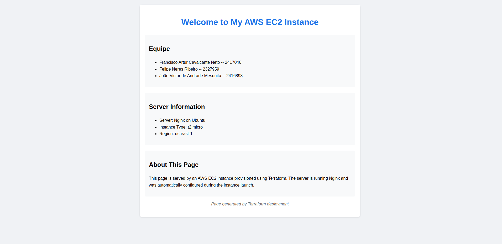
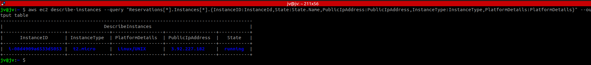
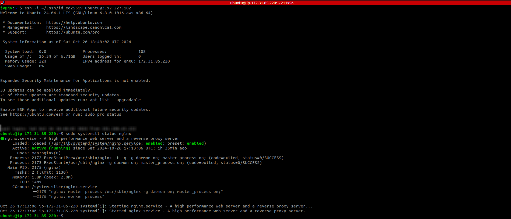
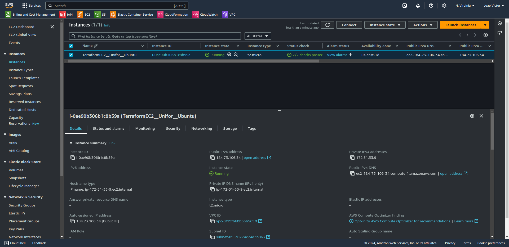

# Infraestrutura Automatizada

<h1 align="center">
  
</h1>

# 💻 Sobre

No arquivo [main.tf](./main.tf) temos basicamente um provider aws e a criação de uma EC2 com instalação de um nginx.

O comando abaixo pode ser útil para ver informações das EC2s ([aqui](.github/aws_ec2_describe.png)):

```bash
aws ec2 describe-instances --query "Reservations[*].Instances[*].{InstanceID:InstanceId,State:State.Name,PublicIpAddress:PublicIpAddress,InstanceType:InstanceType,PlatformDetails:PlatformDetails}" --output table
```
<h1 align="center">
  
</h1>

No arquivo [web_content.tf](./web_content.tf) temos basicamente um null provider -- ferramenta que permite atualizar conteúdo sem tocar na infraestrutura. Também temos um recurso "null_resource" "web_content" com conexão para a EC2 e customização da página index.html do nginx. Dessa forma após fazer qualquer modificação no html, não é necessário destruir (terraform destroy) a máquina, apenas executar terraform apply.

Alguns comandos terraform:

```bash
terraform init
```
```bash
terraform plan
```
```bash
terraform apply
```
```bash
terraform destroy
```

Acessando EC2:

```bash
ssh -i ~/.ssh/id_ed25519 ubuntu@<PUBLIC_IP>
```

Verificando nginx status:

```bash
sudo systemctl status nginx
```
<h1 align="center">
  
</h1>

Máquina EC2 na AWS:
<h1 align="center">
  
</h1>