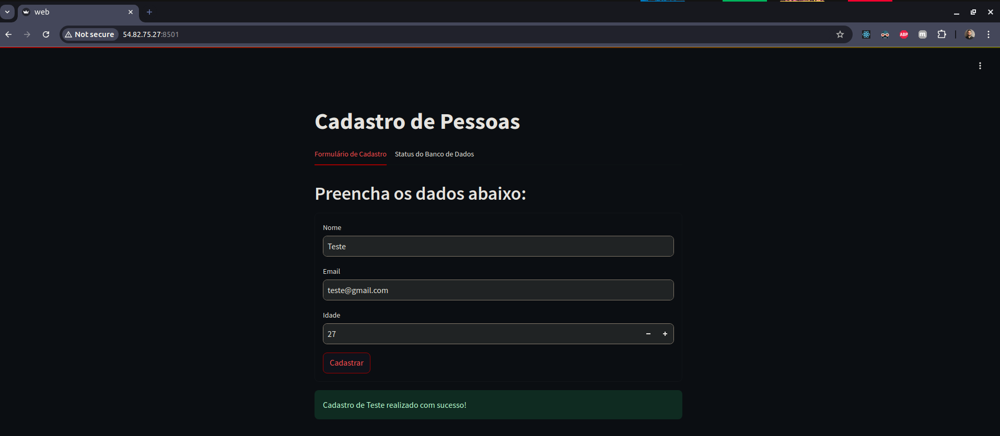
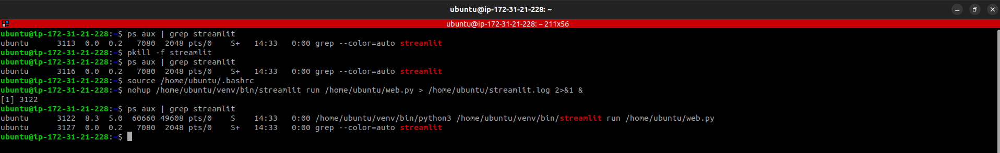
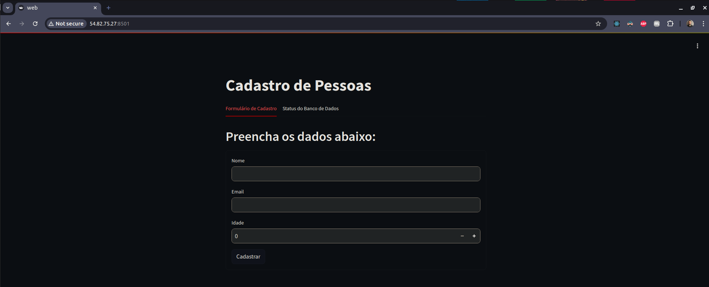
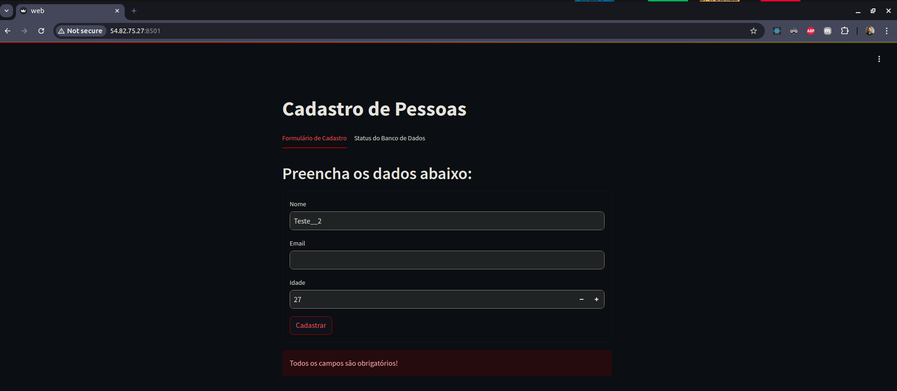
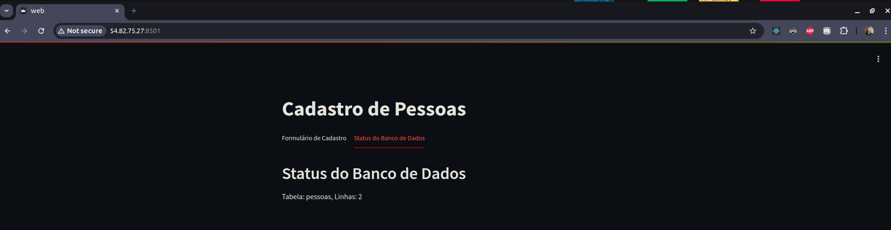
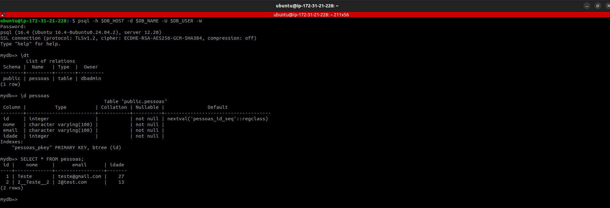

# Infraestrutura Automatizada -- DEV -- Streamlit

<h1 align="center">
  
</h1>

# 💻 Sobre

No arquivo [main.tf](./main.tf) temos basicamente um provider aws, a criação de um banco de dados postgres (rds) e a criação de uma EC2 com execucação da aplicação [Streamlit](./web.py).

Alguns comandos terraform:

```bash
terraform init
```
```bash
terraform plan
```
```bash
terraform apply
```
```bash
terraform destroy
```

Caso precise realizar alguma modificação no arquivo [web.py](./web.py) e enviar para a EC2:

```bash
terraform output PUBLIC_IP
```

```bash
scp -i ~/.ssh/id_ed25519 web.py ubuntu@<PUBLIC_IP>:/home/ubuntu/web.py
```

Acessando EC2:

```bash
ssh -i ~/.ssh/id_ed25519 ubuntu@<PUBLIC_IP>
```

Verificar processo Streamlit:
```sh
ps aux | grep streamlit
```

Kill processo Streamlit:
```sh
pkill -f streamlit
```

Source Environment Variables:
```sh
source /home/ubuntu/.bashrc
```

Start Streamlit Application:
```sh
nohup /home/ubuntu/venv/bin/streamlit run /home/ubuntu/web.py > /home/ubuntu/streamlit.log 2>&1 &
```

Verificar processo Streamlit:
```sh
ps aux | grep streamlit
```

<h1 align="center">
  
</h1>

Acessar Streamlit no navegador:
```bash
http://<PUBLIC_IP>:8501/
```

<h1 align="center">
  
</h1>

<h1 align="center">
  
</h1>

<h1 align="center">
  
</h1>

Verificando dados cadastros com psql dentro da EC2:

```bash
terraform output RDS_ENDPOINT
```

```bash
ssh -i ~/.ssh/id_ed25519 ubuntu@<PUBLIC_IP>
```

```bash
sudo apt update
```

```bash
sudo apt install postgresql-client -y
```

```bash
echo $DB_HOST
echo $DB_NAME
echo $DB_USER
echo $DB_PASS
echo $DB_PORT
```

```bash
psql -h $DB_HOST -d $DB_NAME -U $DB_USER -W
```

```bash
\dt
```

```bash
\d pessoas
```

```bash
SELECT * FROM pessoas;
```

<h1 align="center">
  
</h1>